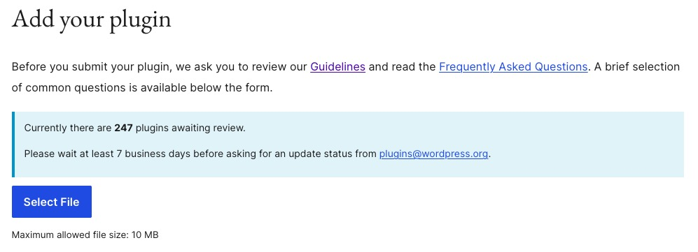
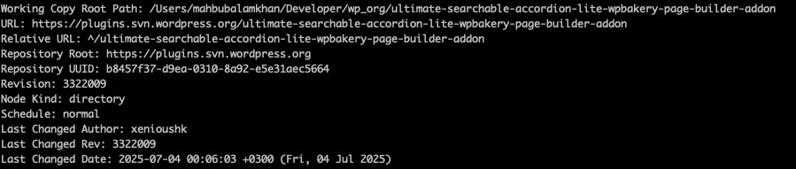
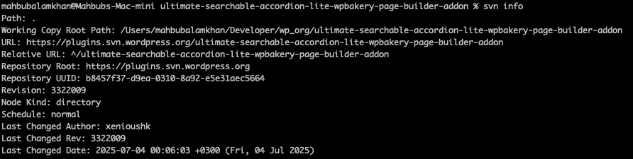

# Submit A Plugin to WordPress.org

A step by step guidelines to submit plugin to WordPress.org

## Submit A New Plugin.

Navgiate to the link and upload your plugin.
https://wordpress.org/plugins/developers/add/



## Check svn status

```bash
svn stat
```

### Add all files to staging

Navigate to the project directory. Run the following command to stage all the files of `trunk` folder.

```bash
svn add trunk/ --force
```

### Commit and Push to WP repository

```bash
svn ci -m "Update readme file"
```

### Tagging Version

Before running the following command, we need to add the stable version tag information to the readme.txt file. Tagging code pattern.

```bash
svn cp "<trunk_path>" "<trunk_version>" -m "tag message"
```

Here are a few examples.

### BWL Advanced FAQ Lite

```bash
svn cp "https://plugins.svn.wordpress.org/bwl-advanced-faq-manager-lite/trunk" \
       "https://plugins.svn.wordpress.org/bwl-advanced-faq-manager-lite/tags/1.1.1" \
       -m "Tagging version 1.1.1"
```

### BWL Poll Manager Lite

```bash
svn cp "https://plugins.svn.wordpress.org/bwl-poll-manager-lite/trunk" \
       "https://plugins.svn.wordpress.org/bwl-poll-manager-lite/tags/1.0.8" \
       -m "Tagging version 1.0.8"
```

### Ultimate Searchable Accordion Lite

```bash
svn cp "https://plugins.svn.wordpress.org/ultimate-searchable-accordion-lite-wpbakery-page-builder-addon/trunk" \
       "https://plugins.svn.wordpress.org/ultimate-searchable-accordion-lite-wpbakery-page-builder-addon/tags/1.0.8" \
       -m "Tagging version 1.0.8"
```

## Update Plugin

- Prepare the files and copy all the files to the `trunk` folder.

🚨 Do not create any folder inside the `trunk` folder. Just copy the plugin files directly into the `trunk` folder. 🚨

- Update the `readme.txt` file with the new version number and any changes made.
- Commit the changes to the SVN repository.
- Run the following command to commit the changes:

```bash
svn add --force trunk/*
```

- Add the new version tag to the SVN repository.

```bash
svn add --force tags/1.1.1
```

- Commit the changes to the SVN repository with a message indicating the update.

```bash
svn commit -m "Updated plugin to 1.1.0"
```

- If you want to check the status of your SVN repository, you can use the following command:

```bash
svn stat
```

- Update your local SVN repository with the latest changes from the remote repository, you can use the following command:

```bash
svn up
```

### More SVN Commands

- If you want to see the status of your SVN repository, you can use the following command:

```bash
svn info
```



- If you want to see the log of your SVN repository, you can use the following command:

```bash
svn log
```



- If you want to delete a file or folder from the SVN repository, you can use the following command:

```bash
svn delete <file_or_folder_path>
```
